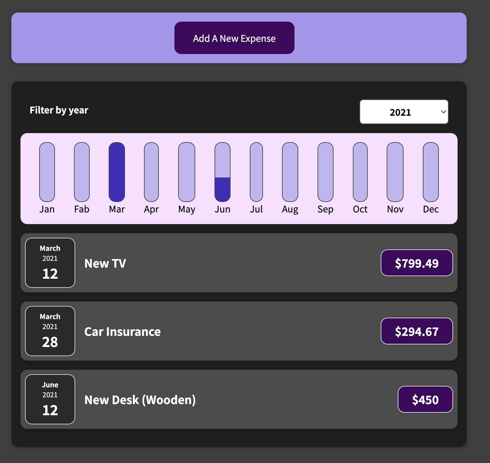
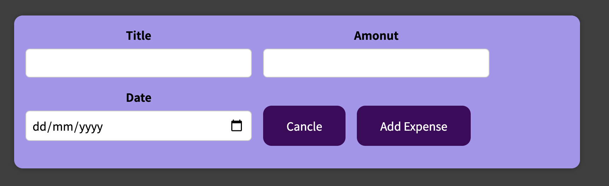

# Expenses Manager App

The Expenses Manager App organises your expenses per month and year, and allows you to review them in a visual graph.

### View expenses
[](assets/view.png)


### Add new expense
[](assets/Add.png)

## Features

- Add an expense (purpose, date, amount)
- Choose the year you want to review
- Display the expenses summed by month in a year

## Tech

- React
- JS
- HTML & CSS
- Node.js

## Installation

Install the dependencies and devDependencies and start the server.

```sh
npm install
npm start